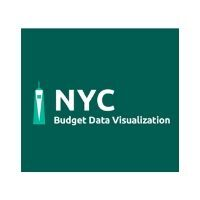

  

# NYC-Budget-Vis

Welcome to NYC Budget Visual! The goal of our app is to make NYC's budget data readily available for organizations whose initiative is to make a difference for our black communities. Our app takes data from NYC Open Data API and represents that information on a line graph.

## What It Looks Like

|     Our Landing Page                 
| ------------------------- |
| | 

### Setting Up Dev Environment:

- Clone the repo and `npm install` the dependencies.
- `npm start` will run in a dev environment.

Deploy Link: https://nyc-budget-vis.herokuapp.com/

This app was created by [Clara](https://github.com/CEsGutierrez), [Jason](https://github.com/cho-jason) and [Simon](https://github.com/SimonGutierrez) using React and Redux. 
